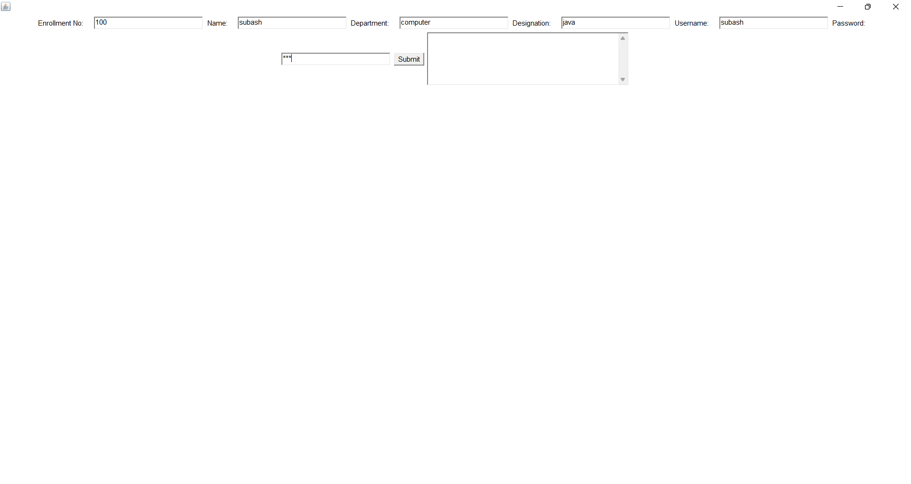
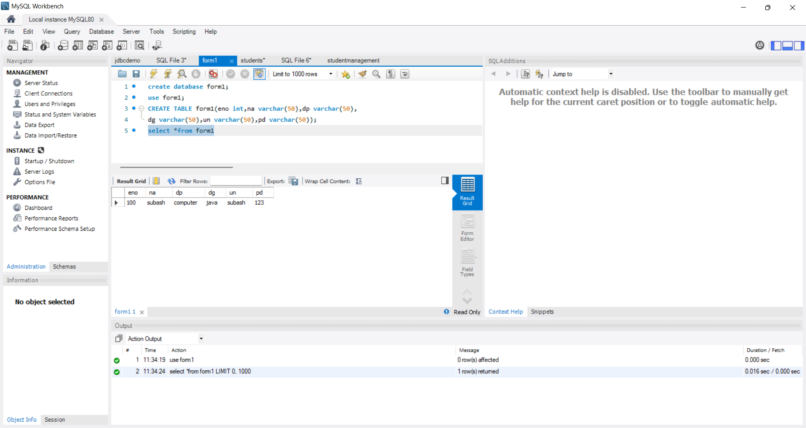

# Project: Student Form Submission System(Register)
    * A Java-based student register form submission system using "Remote Invocation Method" and "MySQL"

# Features
    * Remote database connectivity with MySQL
    * Secure student form submissions using RMI
    * GUI implementation with AWT for user interaction

# Technologies used
    * JAVA
    * RMI
    * MySQL
    * AWT

 # Screenshots
1.Register:

2.Registered Data:

# Installation and Usage:
   * Clone the repository:
     git clone 
     https://github.com/subash19197/Student_Form_Register-Java
   * JDK 22
   * Provide MySQL schema  

# Future Enhancements
    * Implement user authentication
    * Add email notifications for submissions
# Author 
    Subash.S.K
